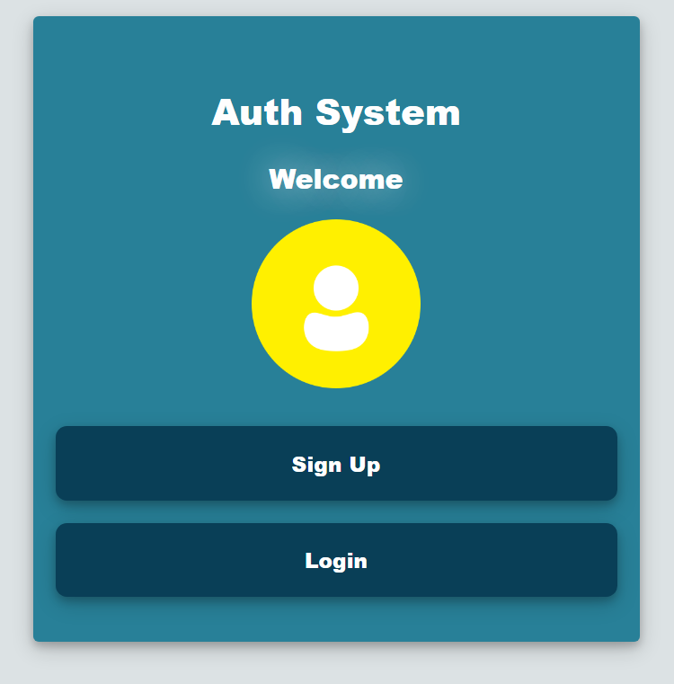
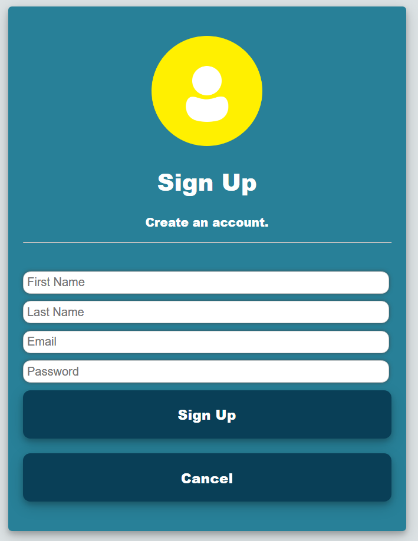
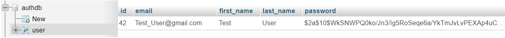
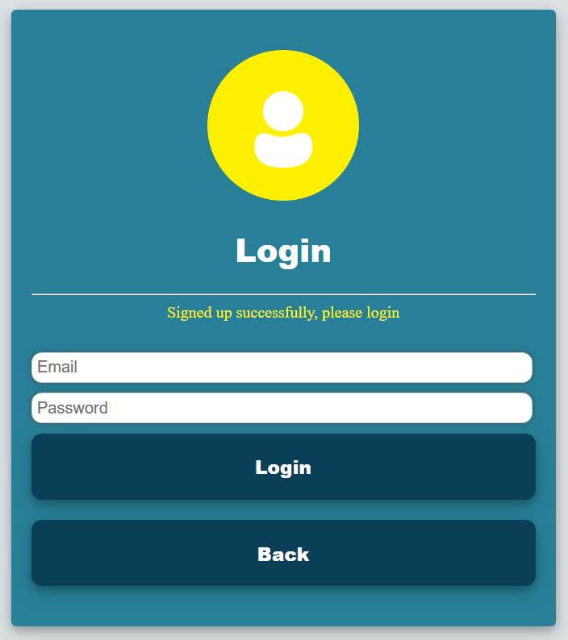
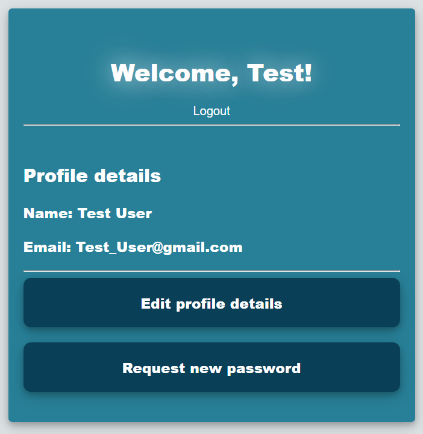
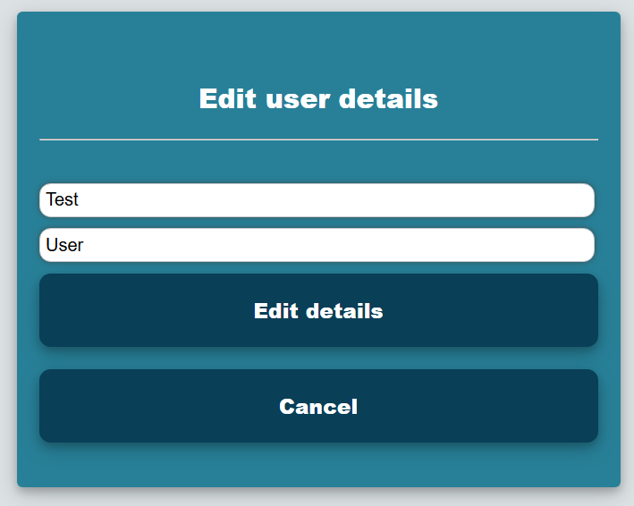
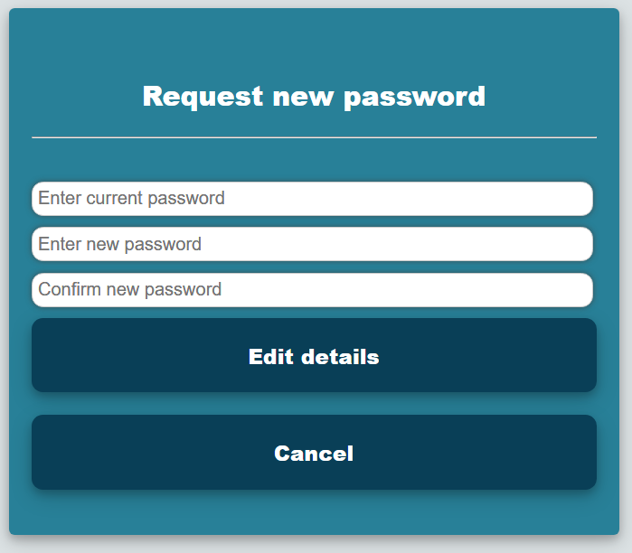

# SpringBoot User Registeration Test

## prerequisites and info:
1) MySQL DB
2) Netbeans
3) DB details in "application.properties"
4) Spring Boot Dependencies in pom.xml

## Mappings:

1) "/" or "/home":
 Welcome page: signup or login if an account is registered

2) "/signup":
  Registeration of a new user (Input validation + duplicate email check + password encoding)

Account saved to db and user directed to login page

3) "/login":
  User enters previously registered email and password

4) "/profile": (if not logged in, the user is redirected to login page)
  Displays details of session user with options to log out, edit details, or request a new password 

5) "/profileEdit": (if not logged in, the user is redirected to login page)
  Allows the user to edit first and last name with the option to cancel

6) "/passEdit": (if not logged in, the user is redirected to login page)
  Allows the user to change password after providing the current one.

## Credits:
tracking-in-expand and text-flicker-in-glow CSS animations from http://animista.net
